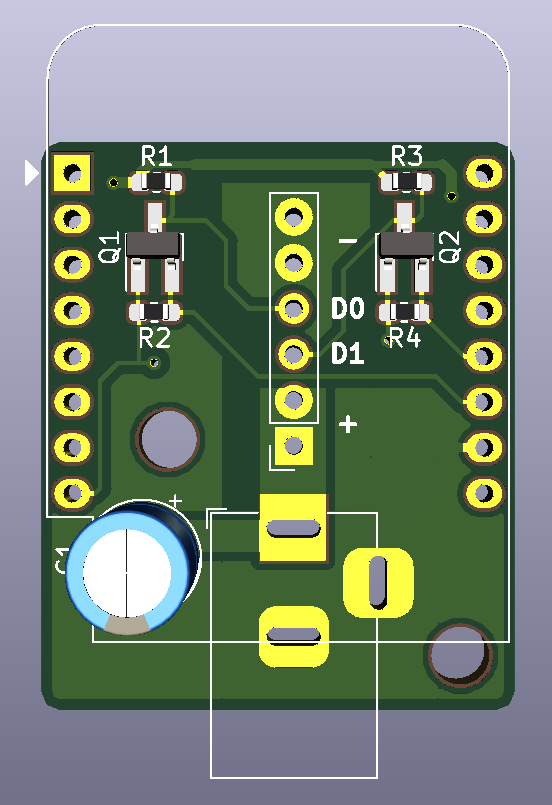
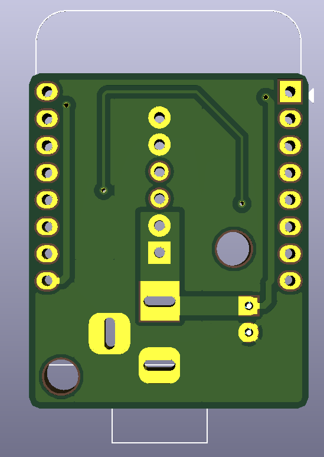

### A small PCB for stacking on a WemosD1-mini to control two strips of WS2812 LEDs

This board has been made to work with [this](https://www.thingiverse.com/thing:2947883) 7 segment clock. It uses 2 mosfets as level-shifters instead of the levelshifter chip originally used. It also incorporates the barrel-jack into the PCB

